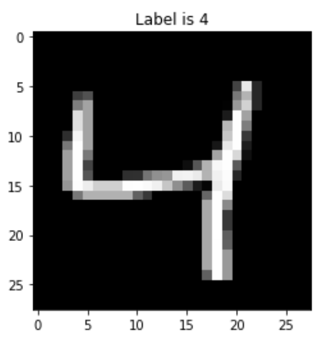
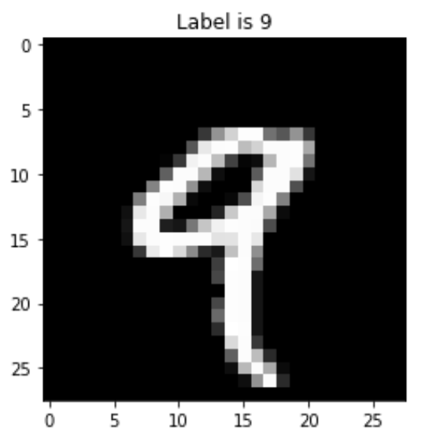

# MNIST-dataset-with-SVMs

- This is a report of a time when I used SVMs to classify two digit classes (4 and 9) from the MNIST dataset
- First, the datasets are downscaled using LDA
- Then, I apply SVMs with the following kernels: linear, poly and rbf
- Error rates and training times are reported

Item from the 4 class:

Item from the 9 class:

